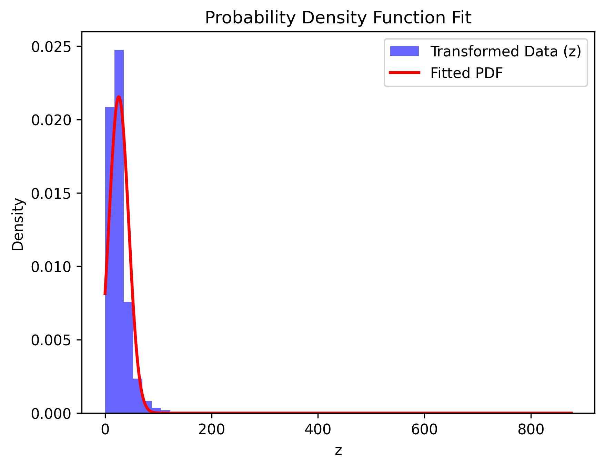

# 🟡 Parameter Estimation using Roll-Number-Parameterized Non-Linear Model

## ⚡ Overview
This repository contains a Python implementation for learning probability density functions using a non-linear model. The project processes the India Air Quality dataset, specifically isolating Nitrogen Dioxide (NO2) as the primary feature ($x$).

**Author:** Vihaan Agarwal
**Roll Number:** 102303658

---

## 💻 Methodology

### 1. Data Transformation
Each $x$ value from the NO2 dataset is transformed into $z$ using the following parameterized function:
$$z = T_r(x) = x + a_r \sin(b_r x)$$

The coefficients $a_r$ and $b_r$ are dynamically generated using my university roll number ($r = 102303658$) via modulo operations:
* $a_r = 0.05 \times (r \pmod 7) = \mathbf{0.1}$
* $b_r = 0.3 \times ((r \pmod 5) + 1) = \mathbf{1.2}$

### 2. Parameter Estimation
The transformed data $z$ is then fitted to the following probability density function (PDF):
$$\hat{p}(z) = c \cdot e^{-\lambda(z-\mu)^2}$$

Using Maximum Likelihood Estimation (MLE) concepts for a normal distribution, the parameters $\lambda$, $\mu$, and $c$ were derived from the transformed dataset.

---

## 📊 Results & Parameters
Based on the data transformation and subsequent estimation, the final learned parameters are:

| Parameter | Symbol | Calculated Value |
| :--- | :---: | :--- |
| **Mean** | $\mu$ | `25.80743` |
| **Lambda** | $\lambda$ | `0.00146` |
| **Normalization Constant** | $c$ | `0.02155` |

### Visualization
Below is the visualization mapping the histogram of the transformed data against the fitted continuous probability density curve:

---

## 🗄️ Repository Contents
* `Assignment_1_102303658.ipynb`: The primary Jupyter Notebook containing the data loading, transformation logic, and mathematical modeling.
* `data.csv`: The India Air Quality dataset.
* `pdf_fit_graph.png`: High-resolution plot comparing the actual data distribution with the fitted curve.

> **Dataset Reference:** > Source: [India Air Quality Data on Kaggle](https://www.kaggle.com/datasets/shrutibhargava94/india-air-quality-data).
